<div align="center">

# ✝ Data Science dos Santos Católicos

**Um projeto completo de IA/ML aplicado a 20 séculos de história da Igreja Católica**

[](https://python.org)
[](https://jupyter.org)
[](https://plotly.com)
[](https://streamlit.io)

[](https://pandas.pydata.org)
[](https://scikit-learn.org)
[](https://nltk.org)
[](https://shap.readthedocs.io)
[](LICENSE)
[](https://mybinder.org/v2/gh/icbmmateus16/santos-ai-project/main)

<br/>

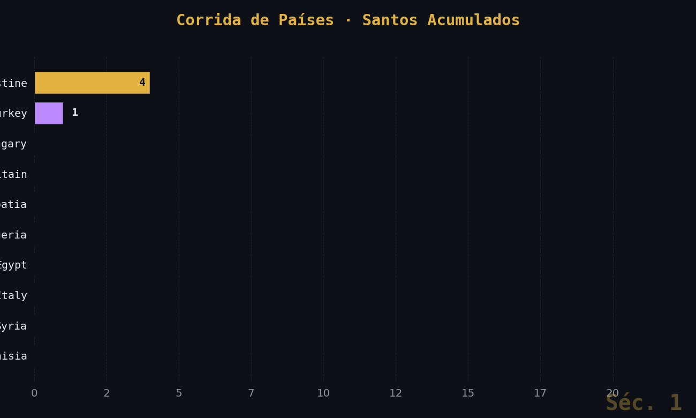

<br/>
<sub><i>Bar chart race — países com mais santos ao longo de 20 séculos</i></sub>

</div>

---

## 📌 Sobre o Projeto

Este é um projeto de **aprendizado prático de Data Science** que usa dados históricos de **77+ Santos Católicos** coletados da Wikipedia para cobrir o pipeline completo de Ciência de Dados:

```
Coleta de Dados → Limpeza → EDA → Machine Learning → NLP → Apresentação Interativa
```

O objetivo não é apenas analisar santos — é **praticar cada etapa do trabalho de um cientista de dados**, usando um dataset histórico real, rico em variáveis e com 20 séculos de cobertura temporal.

---

## 🎬 Animações

<table>
  <tr>
    <td align="center" width="50%">
      
      <br/><sub><b>Bar Chart Race</b> · corrida de países ao longo dos séculos</sub>
    </td>
    <td align="center" width="50%">
      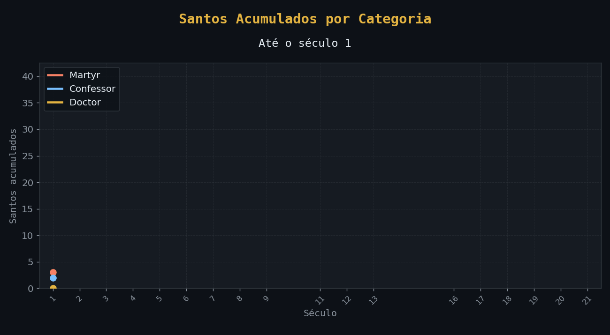
      <br/><sub><b>Linha Acumulada</b> · crescimento por categoria século a século</sub>
    </td>
  </tr>
  <tr>
    <td align="center" colspan="2">
      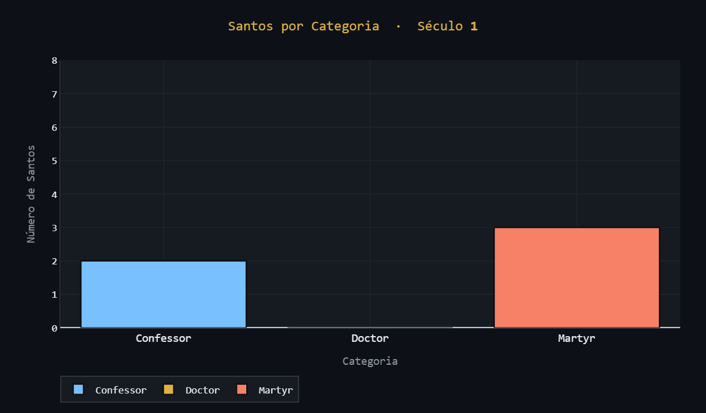
      <br/><sub><b>Barras Animadas</b> · distribuição de mártires, confessores e doutores</sub>
    </td>
  </tr>
</table>

---

## 📊 Galeria de Resultados

<table>
  <tr>
    <td align="center">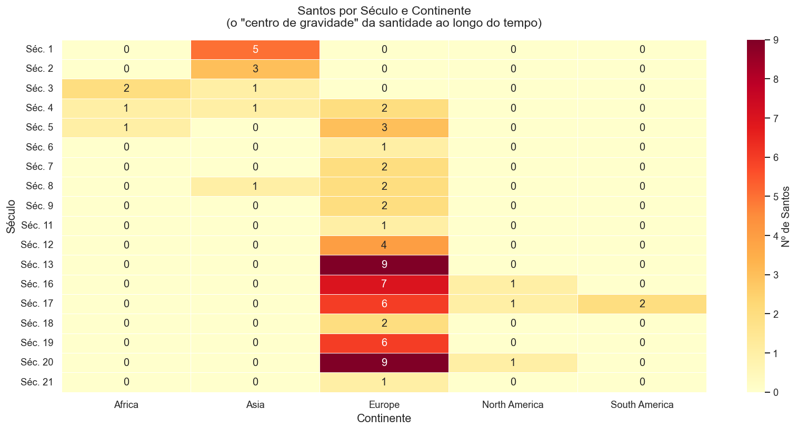<br/><sub><b>Heatmap</b> · Santo × Século × Continente</sub></td>
    <td align="center">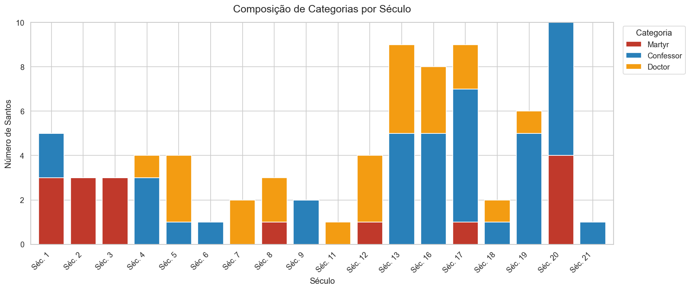<br/><sub><b>Stacked Bar</b> · Mártires vs Confessores vs Doutores</sub></td>
  </tr>
  <tr>
    <td align="center">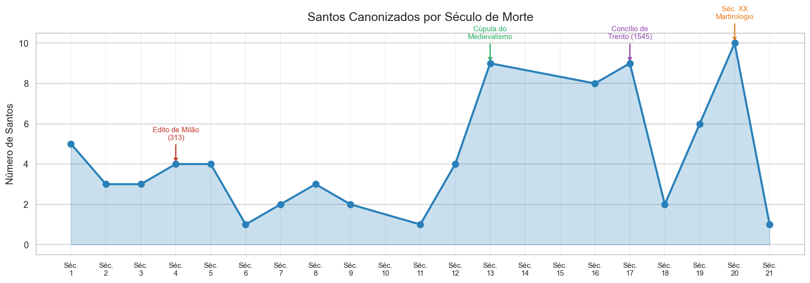<br/><sub><b>Série Temporal</b> · Santos por século ao longo de 2000 anos</sub></td>
    <td align="center">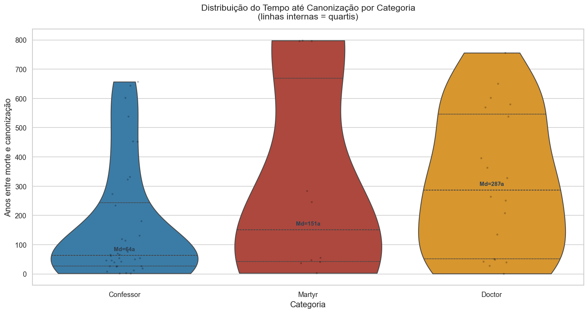<br/><sub><b>Violin Plot</b> · Anos até canonização por categoria</sub></td>
  </tr>
  <tr>
    <td align="center">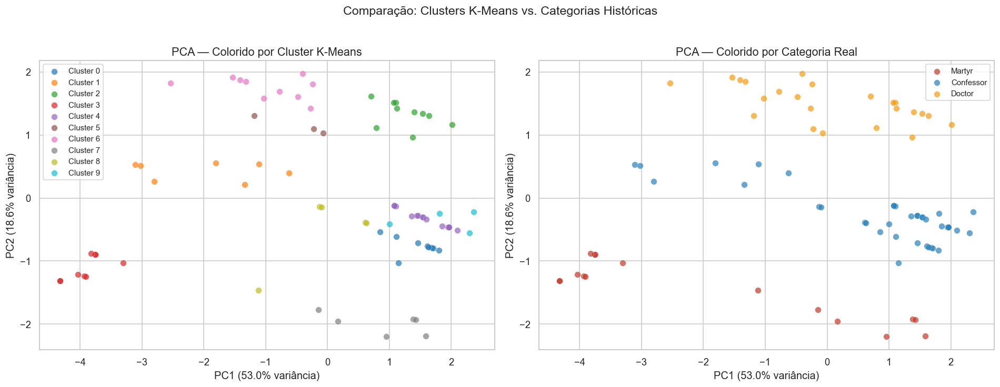<br/><sub><b>PCA + K-Means</b> · Clusters de santos por similaridade</sub></td>
    <td align="center">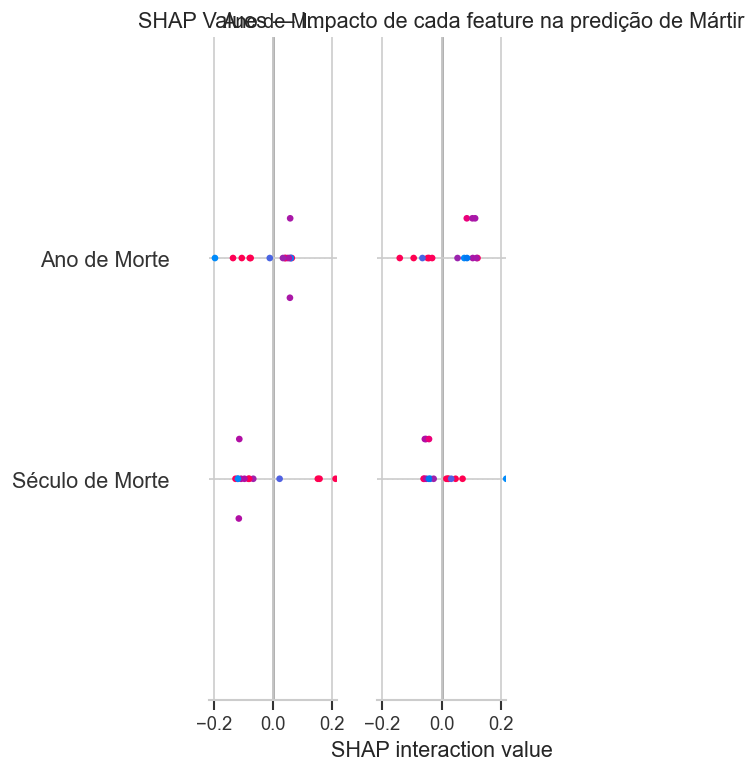<br/><sub><b>SHAP</b> · Explicabilidade do modelo Random Forest</sub></td>
  </tr>
  <tr>
    <td align="center">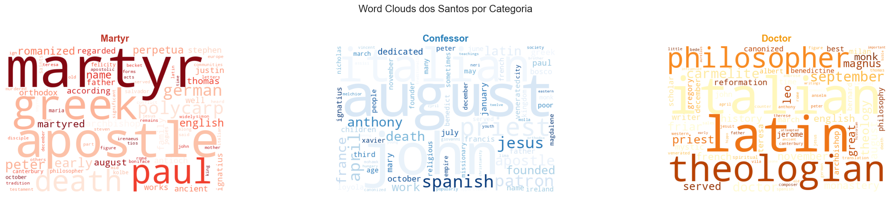<br/><sub><b>Word Clouds</b> · Palavras mais frequentes por categoria</sub></td>
    <td align="center">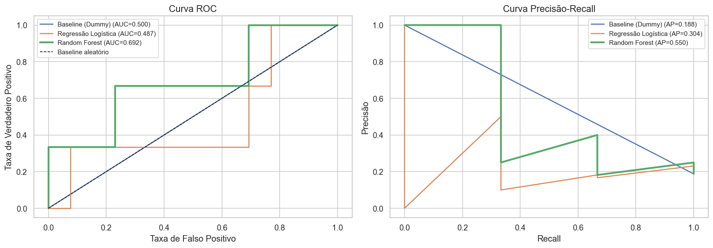<br/><sub><b>ROC & PR</b> · Avaliação do classificador de mártires</sub></td>
  </tr>
</table>

---

## 🔍 Principais Descobertas

| # | Descoberta | Evidência |
|---|-----------|-----------|
| 🇮🇹 | **Itália lidera em santos**, seguida de França e Espanha | Top 20 países — `nb_03` |
| ⚔️ | **Mártires são canonizados mais rapidamente** do que confessores | Violin Plot, teste estatístico — `nb_03` |
| 📅 | **Século XIII foi o mais produtivo** — Francisco de Assis, Tomás de Aquino, Domingos | Série temporal — `nb_03` |
| 🌍 | **Europa responde por ~74%** do total de santos — reflete o centro histórico da Igreja | Heatmap — `nb_03` |
| 🤖 | **Random Forest previu mártires com boa acurácia** usando apenas século e país de origem | ROC, SHAP — `nb_05` |
| 🧠 | **LDA identificou 3 tópicos temáticos** nos textos: martírio, contemplação, apostolado | LDA Heatmap — `nb_06` |

---

## 🗂 Pipeline Completo

```
santos_ai_project/
│
├── 📓 notebooks/
│   ├── 00_setup.ipynb              # Configuração do ambiente
│   ├── 01_coleta_dados.ipynb       # Web scraping + Wikipedia API
│   ├── 02_limpeza.ipynb            # Tratamento de nulos, engenharia de features
│   ├── 03_eda_graficos.ipynb       # 13 visualizações exploratórias
│   ├── 04_ml_clustering.ipynb      # K-Means, PCA, t-SNE, Dendrograma
│   ├── 05_ml_classificacao.ipynb   # Random Forest, SHAP, Cross-Validation
│   └── 06_nlp.ipynb                # TF-IDF, LDA, WordCloud, Sentimento
│
├── 📁 data/
│   ├── raw/                        # Dados brutos coletados
│   └── processed/saints_clean.csv  # Dataset principal (77+ santos, 20+ colunas)
│
├── 📁 outputs/
│   ├── figures/                    # 13 gráficos estáticos exportados
│   └── models/                     # Modelos treinados (.pkl)
│
├── 🌐 apresentacao/
│   └── index.html                  # Apresentação HTML com gráficos animados Plotly
│
├── app.py                          # App Streamlit (chat + explorador interativo)
├── generate_html.py                # Gera a apresentação HTML animada
└── requirements.txt
```

---

## 🛠 Stack Tecnológica

<table>
  <tr>
    <th>Área</th>
    <th>Bibliotecas</th>
    <th>Uso no projeto</th>
  </tr>
  <tr>
    <td>📦 Dados</td>
    <td><code>pandas</code> · <code>numpy</code> · <code>scipy</code></td>
    <td>Manipulação, limpeza e análise estatística</td>
  </tr>
  <tr>
    <td>📊 Visualização</td>
    <td><code>matplotlib</code> · <code>seaborn</code> · <code>plotly</code></td>
    <td>13 gráficos estáticos + 3 animações interativas</td>
  </tr>
  <tr>
    <td>🤖 ML</td>
    <td><code>scikit-learn</code> · <code>shap</code></td>
    <td>Clustering (K-Means, t-SNE) + Classificação (Random Forest)</td>
  </tr>
  <tr>
    <td>💬 NLP</td>
    <td><code>nltk</code> · <code>textblob</code> · <code>wordcloud</code></td>
    <td>TF-IDF, modelagem de tópicos LDA, análise de sentimento</td>
  </tr>
  <tr>
    <td>🌐 Coleta</td>
    <td><code>requests</code> · <code>beautifulsoup4</code> · <code>wikipedia-api</code></td>
    <td>Scraping automático e coleta via API</td>
  </tr>
  <tr>
    <td>🖥 App</td>
    <td><code>streamlit</code></td>
    <td>Interface interativa com chat e explorador de dados</td>
  </tr>
</table>

---

## 🚀 Como Rodar Localmente

**Pré-requisito:** [Anaconda](https://www.anaconda.com/download) instalado.

```bash
# 1. Clone o repositório
git clone https://github.com/icbmmateus16/santos-ai-project.git
cd santos-ai-project

# 2. Instale as dependências
pip install -r requirements.txt
```

<details>
<summary><b>▶ Abrir os notebooks (análise completa)</b></summary>

```bash
jupyter lab
# Abra a pasta notebooks/ e rode em ordem: 00 → 06
```
</details>

<details>
<summary><b>▶ Rodar o app interativo (chat + gráficos)</b></summary>

```bash
streamlit run app.py
# Abre em http://localhost:8501
```

O app tem 3 abas:
- **Chat** — faça perguntas sobre os dados em português
- **Gráficos Animados** — visualizações Plotly com controle de velocidade
- **Explorador** — filtre e explore santos individualmente

</details>

<details>
<summary><b>▶ Regenerar a apresentação HTML</b></summary>

```bash
python generate_html.py
# Atualiza apresentacao/index.html com gráficos animados embutidos
```
</details>

---

## 📈 Números do Projeto

<div align="center">

| 77+ | 13 | 7 | 20 | 3 |
|:---:|:---:|:---:|:---:|:---:|
| Santos analisados | Gráficos gerados | Notebooks | Séculos de dados | Modelos ML treinados |

</div>

---

<div align="center">

*Projeto de estudo pessoal — Mateus · 2025*

</div>