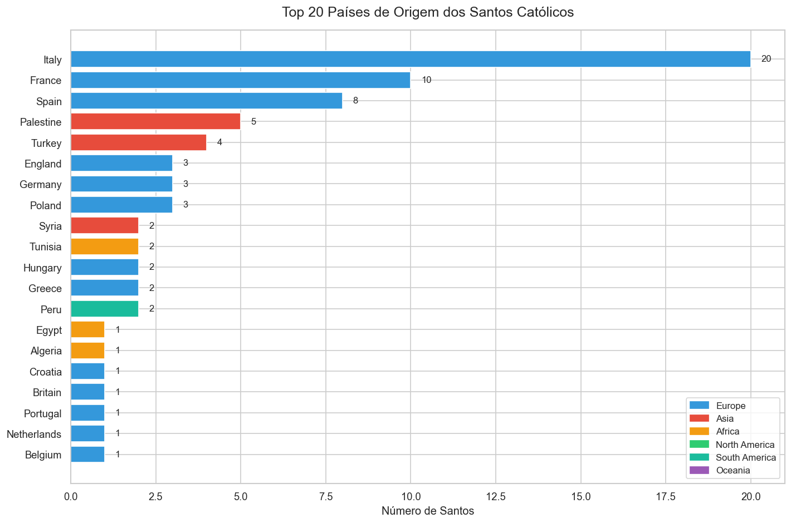

# ✝ Data Science dos Santos Católicos


> Projeto de aprendizado de IA/ML que usa dados históricos dos Santos Católicos para praticar as principais técnicas de Ciência de Dados — desde coleta até Machine Learning e NLP.

---

## 📊 Visualizações

<table>
  <tr>
    <td><br><sub>Top 20 países com mais santos</sub></td>
    <td><br><sub>Santos canonizados por século</sub></td>
  </tr>
  <tr>
    <td><br><sub>Heatmap: século × continente</sub></td>
    <td><br><sub>Mártires vs Confessores vs Doutores</sub></td>
  </tr>
  <tr>
    <td><br><sub>Clustering PCA dos santos</sub></td>
    <td><br><sub>SHAP: importância das variáveis (Random Forest)</sub></td>
  </tr>
  <tr>
    <td><br><sub>Word Clouds por categoria</sub></td>
    <td><br><sub>Curvas ROC e Precision-Recall</sub></td>
  </tr>
</table>

---

## 📓 Notebooks

| # | Notebook | Técnicas |
|---|----------|----------|
| `00` | Setup do Projeto | Python, Jupyter, pathlib |
| `01` | Coleta de Dados | Web Scraping, Wikipedia API, pd.read_html |
| `02` | Limpeza de Dados | pandas, SimpleImputer, missingno |
| `03` | EDA & Visualizações | seaborn, matplotlib, plotly — **13 gráficos** |
| `04` | ML: Clustering | K-Means, PCA, t-SNE, Dendrograma |
| `05` | ML: Classificação | Random Forest, ROC Curve, SHAP, Cross-Validation |
| `06` | NLP | TF-IDF, LDA, WordCloud, TextBlob |

---

## 🔍 Principais Descobertas

- **Itália lidera em Santos** — seguida de França e Espanha, refletindo a centralidade de Roma
- **Mártires são canonizados mais rápido** — testemunho claro acelera o processo
- **Século XIII foi o mais produtivo** — Francisco de Assis, Tomás de Aquino, Domingos de Gusmão
- **Random Forest prevê mártires com boa acurácia** — usando apenas século e país de origem

---

## 🚀 Como rodar localmente

```bash
# 1. Instalar dependências (Anaconda recomendado)
pip install -r requirements.txt

# 2. Abrir notebooks
jupyter lab

# 3. App interativo com chat + gráficos animados
streamlit run app.py

# 4. Regenerar apresentação HTML
python generate_html.py
```

---

## 🗂 Estrutura

```
santos_ai_project/
├── notebooks/          # 7 notebooks Jupyter (00 → 06)
├── data/
│   ├── raw/            # Dados brutos coletados
│   └── processed/      # saints_clean.csv — dataset principal
├── outputs/
│   ├── figures/        # 13 gráficos exportados
│   └── models/         # Modelos ML treinados
├── apresentacao/       # Apresentação HTML com gráficos animados
├── app.py              # App Streamlit (chat + explorador)
├── generate_html.py    # Injeta gráficos animados no HTML
└── requirements.txt
```

---

## 🛠 Stack

| Área | Bibliotecas |
|------|-------------|
| Manipulação de dados | pandas, numpy, scipy |
| Visualização | matplotlib, seaborn, plotly |
| Machine Learning | scikit-learn, shap |
| NLP | nltk, textblob, wordcloud |
| Coleta de dados | requests, beautifulsoup4, wikipedia-api |
| App interativo | streamlit |

---

*Projeto de estudo pessoal — Mateu, 2025*